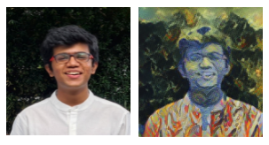
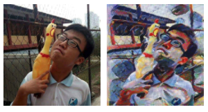
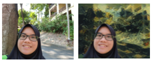
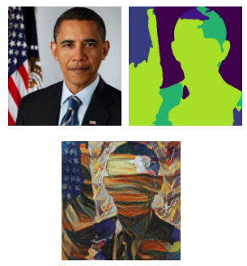
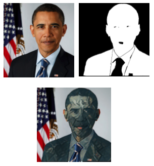

# Semantically Segmented Neural Style Transfer
### An amalgamation of semantic segmentation and neural style transfer

Sidharrth Nagappan, Cornelius Pang and Nadia Ahmad Pirdaus

#### Abstract

This work proposes a web application that demonstrates the power of neural style transfer when coupled with foreground-background and automated semantic segmentation. Pioneered training on the Stanford Background dataset, the style transfer app is capable of generating remarkably aesthetic results albeit unconventional ones at times. The main motivation of this application is to enable users to convert their memorable moments captured in images into wonderful works of art from various well-known styles.

#### Introduction

Pablo Picasso once said “good artists copy, great artists steal”. In art, there have been countless attempts shown by artists to compose unique visual experiences by combining the style of an image and the content of another image. Recent advances in Convolutional Neural Networks have enabled researchers to create artificial systems that generate artistic images with high perceptual accuracy. The problem that we propose to study is style transfer - a process of transferring the semantic content of an image to other images of different styles.

Style transfer algorithms have shown remarkable performance in recent years. In this work, we propose a semantically segmented style transfer algorithm that combines the benefits of scene parsing with style transfer to generate aesthetically interesting graphics. A combination of several style transfer algorithms, segmentation models and image processing techniques will be fused into a pipeline for what we term semantically segmented artistic style transfer.

#### Downloading the trained models

You can download the trained Pytorch UNet segmentation model from [here](https://drive.google.com/drive/folders/1DLWMrLhO5JNMgAQHi8FcMp7gyESfTQv3?usp=sharing) as 'trained-model.pth'.

You can find the Detectron2 pretrained model from [here](https://drive.google.com/drive/folders/1DLWMrLhO5JNMgAQHi8FcMp7gyESfTQv3?usp=sharing) named as 'model_final_a3ec72.pkl', courtesy of Facebook AI Research.

You can find the Magenta pretrained model from [here](https://drive.google.com/drive/folders/1DLWMrLhO5JNMgAQHi8FcMp7gyESfTQv3?usp=sharing).


#### Running the app

**Note: Do not run the notebooks.**

Ensure all requirements are downloaded. If not, create a virtual environment and:

```
pip3 install -r requirements.txt
```

After this, you can run the app:

```
streamlit run app.py
```

#### Results


<br/>


<br />


<br />


<br />


<br />

#### References

Kyprianidis, J. E., Collomosse, J., Wang, T., & Isenberg, T. (2013). State of the "Art”: A taxonomy of artistic stylization techniques for images and video. IEEE Transactions on Visualization and Computer Graphics, vol. 19, no. 5, pp. 866-885. doi: 10.1109/TVCG.2012.160.

Efros, A. A., & Leung, T. K. (1999). Texture synthesis by non-parametric sampling. Proceedings of the Seventh IEEE International Conference on Computer Vision, 2, 1033-1038 vol.2.

Gatys, L. A., Ecker A. S., & Bethge, M. (2016). Image style transfer using convolutional neural networks. 2016 IEEE Conference on Computer Vision and Pattern Recognition (CVPR), pp. 2414-2423. doi: 10.1109/CVPR.2016.265.

Prisma Labs. (2016). Styling solely the foreground or background of an image [Screenshot]. Lensa. https://prisma-ai.com/


Ghiasi, G., Lee, H., Kudlur, M., Dumoulin, V., & Shlens, J. (2017). Exploring the structure of a real-time, arbitrary neural artistic stylization network. British Machine Vision Conference (BMVC) 2017.

Makow, N., & Hernandez, P. (2017). Exploring style transfer: Extensions to neural style transfer.
